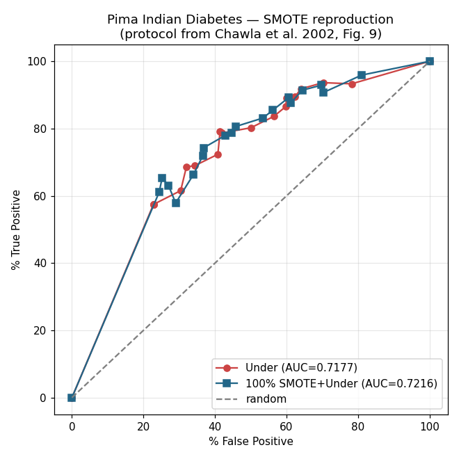

# Reproducing SMOTE (Chawla et al., 2002)

A from-scratch reproduction of **SMOTE: Synthetic Minority Over-sampling
Technique** (Chawla, Bowyer, Hall & Kegelmeyer, *JAIR* 16, 2002). The SMOTE
algorithm is re-implemented in NumPy - not imported from a library - and the
paper's ROC/AUC experimental protocol is rebuilt and run on the Pima Indian
Diabetes dataset. My AUCs land within ~0.01 of the paper's, and my from-scratch
SMOTE matches `imbalanced-learn` to within 0.001.

## What SMOTE is (and isn't)

SMOTE is a *data transformer*. Imbalanced data breaks
classifiers: if 5% of samples are the "positive" class, a model can score 95%
accuracy by ignoring them entirely. The naive fix - duplicating minority rows -
just makes the classifier memorise those exact points (overfitting). SMOTE
instead **invents new, plausible minority points** by interpolating between real
neighbours:

```
new = A + gap * (B - A),   gap ~ Uniform(0, 1)
```

where `A` is a minority point and `B` is one of its k nearest minority
neighbours. Every synthetic point lands on the line segment between two real
minority points, filling in the *region* the class occupies so the classifier
learns a broader, more general decision boundary.

## Pipeline (and the one rule you must not break)

```
load -> explore -> clean -> STRATIFIED split -> scale -> SMOTE -> model -> evaluate
                                          |                 |          |
                                   test set frozen    train only   train only
```

**SMOTE touches the training fold only — never the test fold, never before the
split.** Resampling before splitting leaks synthetic points (derived from real
points) into both sets, the model effectively sees test answers, and the AUC
becomes a lie. The test set must stay a pristine sample of the real, imbalanced
world, because that is what production looks like. This is enforced inside every
cross-validation fold in `src/evaluate.py`.

## The reproduction protocol (why this isn't just `roc_auc_score`)

A normal AUC sweeps the *decision threshold* of one trained model. The paper
does something different (Section 5.2): it sweeps the *training-set class
balance*. Each point on the ROC curve is a **separately trained classifier** -
minority fixed at a chosen SMOTE level, majority randomly under-sampled at
increasing degrees (10% … 2000%). Heavier under-sampling pushes the operating
point up-and-right. Those points trace the curve; the area under it (trapezoid
rule, Section 5.3) is the AUC. Rebuilding *this* protocol is what makes the
project a reproduction rather than a library call.

## Results — Pima Indian Diabetes

Base classifier: decision tree. 10-fold cross-validation. Paper values are from
Table 3 (C4.5, ÷10000).

| method                | paper  | mine   | diff    |
|-----------------------|--------|--------|---------|
| plain under-sampling  | 0.7242 | 0.7177 | −0.0065 |
| SMOTE(100%) + under   | 0.7307 | 0.7216 | −0.0091 |

**SMOTE lift over baseline:** paper +0.0065, mine +0.0039 — same direction, same
tiny magnitude.



### Why the small lift is the *correct* result

Pima is the **least-skewed** dataset in the paper (1.87 : 1). The paper itself
notes SMOTE barely helps here and that Naive Bayes actually beats SMOTE-C4.5 on
Pima. A near-flat lift is the honest finding, not a bug - Pima is for proving the
machinery is correct. Datasets like Mammography or Satimage (far more skewed) are
where SMOTE's benefit is large, and are the natural next targets.

### Why my absolute numbers differ from the paper's

The paper used **C4.5**; scikit-learn's `DecisionTreeClassifier` is **CART** -
different split criterion (gain ratio vs Gini) and different pruning. Reproduction
means matching the **trend and methodology**, not the fourth decimal. Landing
within ~0.01 across both curves, with the SMOTE-over-Under ordering preserved, is
a successful reproduction.

## Verifying the from-scratch SMOTE is correct

`05_verify_vs_imblearn.py` runs my SMOTE and `imbalanced-learn`'s SMOTE through
an identical CV pipeline:

| implementation      | 10-fold AUC |
|---------------------|-------------|
| from-scratch (mine) | 0.6642      |
| imbalanced-learn    | 0.6633      |
| difference          | 0.0010      |

Agreement to 0.001 confirms the implementation is faithful. (This uses a plain
single-model AUC, so the number is lower than the swept-protocol AUC above — two
different measurements, deliberately.)

## Repo layout

```
smote-reproduction/
├── config.py                 # seeds, paths, protocol constants
├── requirements.txt
├── src/
│   ├── smote.py              # ★ from-scratch SMOTE (annotated to paper line numbers)
│   ├── data_loader.py        # uniform (X, y) loading
│   └── evaluate.py           # ROC-sweep protocol + trapezoidal AUC
└── scripts/
    ├── 01_download_data.py
    ├── 02_explore.py         # confirm the imbalance
    ├── 03_run_experiments.py # Under vs SMOTE curves -> results/pima_results.json
    ├── 04_compare_to_paper.py# my AUCs vs Table 3
    ├── 05_verify_vs_imblearn.py
    └── 06_plot_roc.py        # results/pima_roc.png
```

## Run it

```bash
pip install -r requirements.txt
python scripts/01_download_data.py
python scripts/02_explore.py
python scripts/03_run_experiments.py
python scripts/04_compare_to_paper.py
python scripts/05_verify_vs_imblearn.py
python scripts/06_plot_roc.py
```

## What this demonstrates

- Reading a primary source and translating pseudo-code into correct, tested code.
- Understanding SMOTE as preprocessing, not a model — and why interpolation beats
  duplication.
- Avoiding resampling data leakage (a classic interview trap).
- Rebuilding an experimental protocol faithfully, then reasoning honestly about
  why results diverge (C4.5 vs CART) instead of fudging them.

## Next steps

- Run on **Mammography** / **Satimage** where SMOTE's effect is large.
- Add an **XGBoost** baseline and test whether SMOTE still helps a modern model
  (often it helps far less — a strong talking point).

## Reference

Chawla, N. V., Bowyer, K. W., Hall, L. O., & Kegelmeyer, W. P. (2002).
*SMOTE: Synthetic Minority Over-sampling Technique.* Journal of Artificial
Intelligence Research, 16, 321–357.
